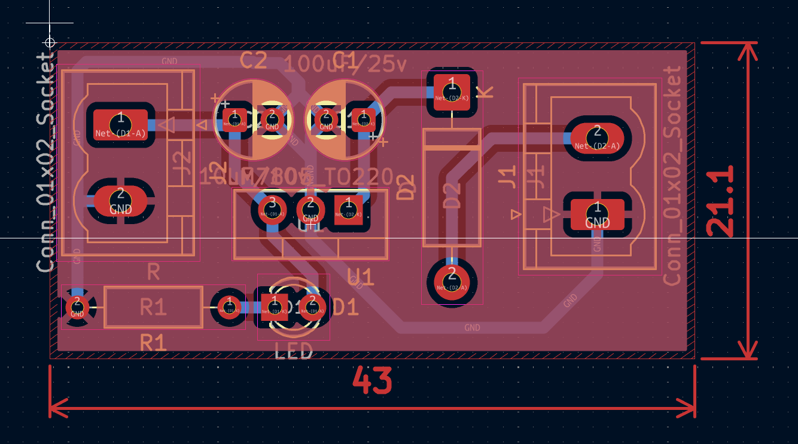

# 🔌 7805 Voltage Regulator 5V – PCB

A compact 5V linear voltage regulator PCB based on the LM7805 IC.  
Designed for stable 5V output for microcontrollers, sensors, and small embedded systems.

---

## 📌 Overview

This project is a custom-designed 2-layer Printed Circuit Board created using KiCad.  
It converts a higher DC input voltage into a regulated 5V output using the LM7805 linear regulator.

### Key Features

- Input Voltage: 7V – 20V DC  
- Output Voltage: 5V ±5%  
- Max Output Current: Up to 1A (with proper heat dissipation)  
- Protection:  
  - Internal Thermal Shutdown (LM7805 built-in)  
  - Internal Current Limiting  
- Board Type: 2-layer  
- Mounting: Through-hole  
- Decoupling Capacitors included for stability  

---

## 🧠 Design Specifications

| Parameter        | Value            |
|------------------|------------------|
| PCB Size         | 43 mm x 21 mm    |
| Layers           | 2                |
| Copper Thickness | 1 oz             |
| Operating Temp   | 0°C to 125°C (IC)|
| Efficiency       | ~40–70% (depends on Vin) |

> Note: Efficiency depends on input voltage due to linear regulation.  
> Power dissipation = (Vin – 5V) × Load Current.

---

## 🔧 Schematic

The schematic includes:

- LM7805 regulator  
- Input filtering capacitor (e.g., 0.33µF)  
- Output capacitor (e.g., 0.1µF + 10µF)  
- Optional input reverse polarity diode  

---

## 🖥️ PCB Layout

Design considerations:

- Short trace between regulator and capacitors  
- Wide traces for input/output current path  
- Proper ground return path  
- Provision for heatsink mounting  

---

## 📦 Manufacturing Details

- Gerber files: [[manufacturing files]]

Compatible with:

- JLCPCB  
- PCBWay  
- Any standard Gerber-based PCB manufacturer  

---

## 🧪 Testing & Validation

i haven't done that but here are some 3d model 

---

## ⚙️ Tools Used

- KiCad (Version 9.0)  
- Digital Multimeter  
- Bench Power Supply  
- Electronic Load / Resistor Load  
- datasheet used by texes instruments 

---

## ⚠️ Thermal Considerations

Since this is a linear regulator:

If Vin = 12V and I = 1A  
Power Dissipation = (12 - 5) × 1 = 7W  

Proper heatsinking is mandatory for high current operation.

---

## 🚀 Future Improvements

- Add reverse polarity protection diode  
- Add input fuse  
- Convert to switching regulator version for higher efficiency  
- Add screw terminals for better connectivity  

---

## 👨‍💻 Author

Atharva Tikle  
Electronics | Embedded Systems | PCB Design

